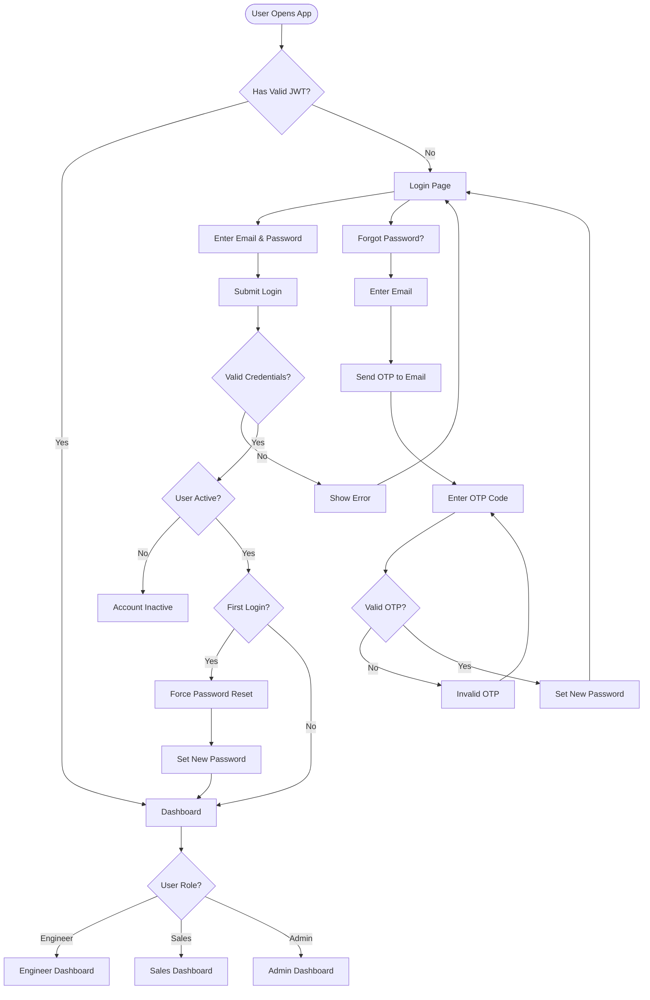
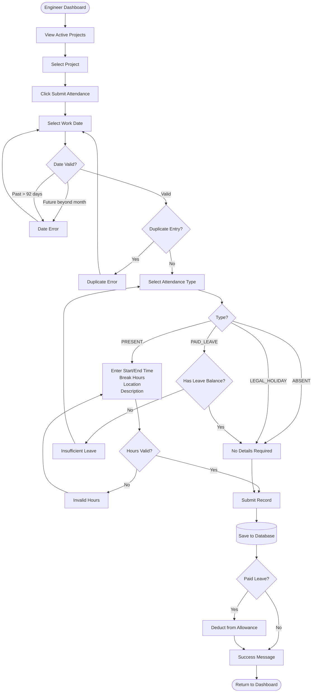
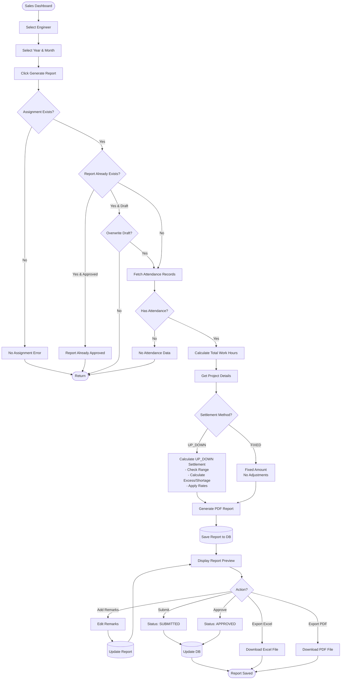
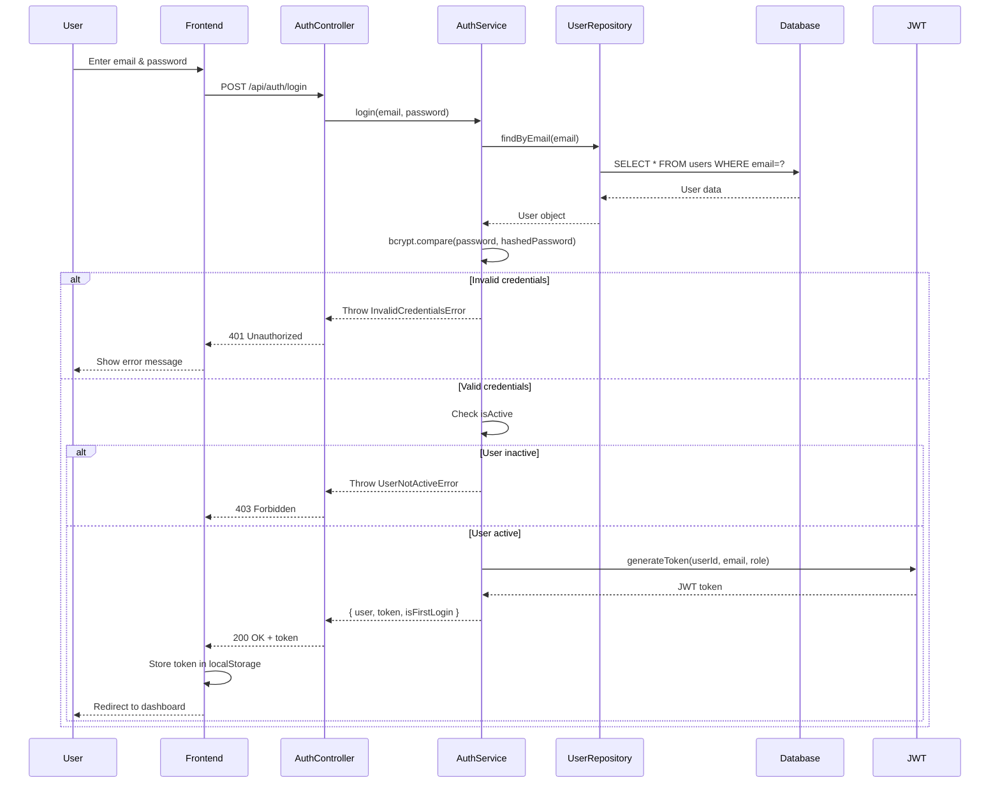
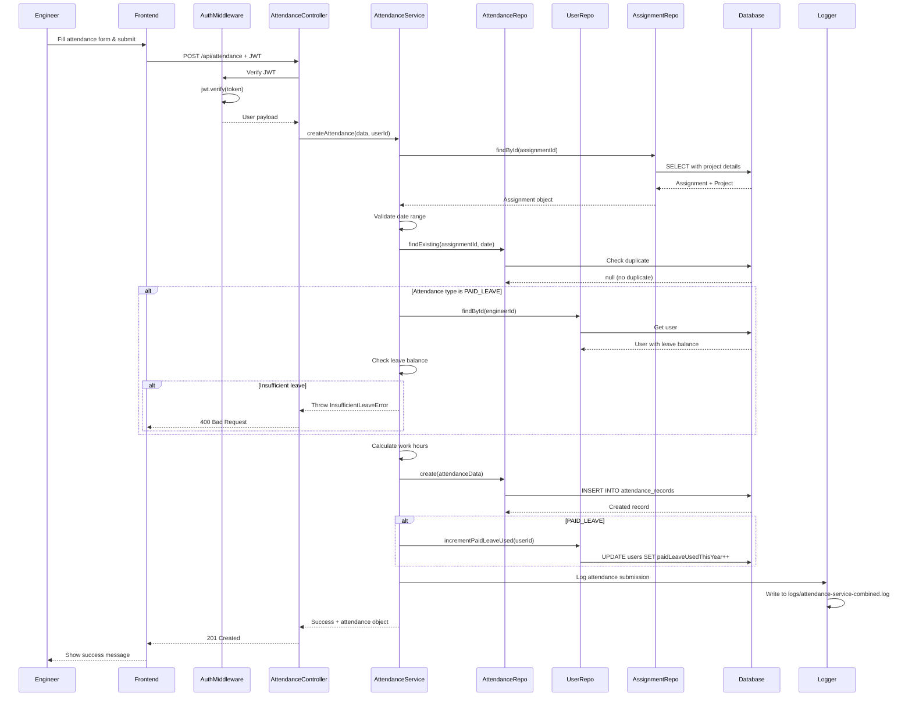
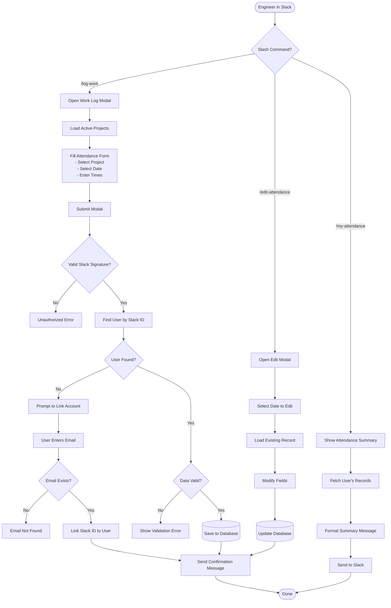
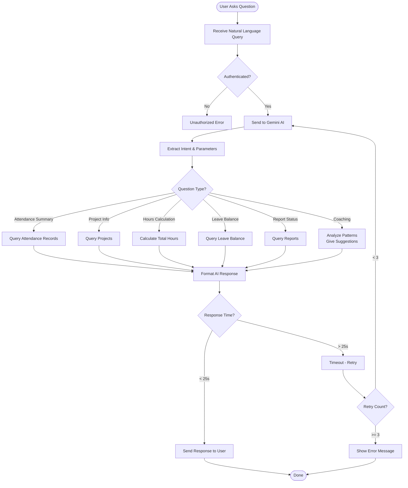

# Attendance & Availability Management — Frontend

> Frontend companion for the Attendance & Availability Management System.  
> Portions of this README (architecture, flows, diagrams, API contract notes) are shared with the backend README for consistency.

---

## Table of Contents

- [Project Overview](#project-overview)
- [Tech Stack](#tech-stack)
- [Directory Structure](#directory-structure)
- [Getting Started (Local Dev)](#getting-started-local-dev)
- [Environment Variables](#environment-variables)
- [Scripts](#scripts)
- [i18n (Localization)](#i18n-localization)
- [Auth & API Integration](#auth--api-integration)
- [Mermaid Diagrams (Shared Flows)](#mermaid-diagrams-shared-flows)
- [Troubleshooting & Common Issues](#troubleshooting--common-issues)
- [Contributing & License](#contributing--license)

---

## Project Overview

This repository contains the **frontend** (Next.js + React) for the Attendance & Availability Management System.  
It provides UIs for Engineers, Sales, and Admins to submit and edit daily attendance, view dashboards and reports, trigger monthly report generation, and interact with Slack & the AI chatbot. Many architectural and workflow details are shared with the backend; where content is identical it has been kept consistent.

---

## Tech Stack

- **Next.js** - App router
- **React** - Functional components, hooks
- **Chakra UI** - Component library
- **Axios** - HTTP client
- **react-hook-form + zod** - Forms & validation
- **next-i18next / i18next** - i18n
- **framer-motion** - Animations
- **ESLint, Prettier, Husky** - Tooling
- **TypeScript** - (optional, recommended)

---

## Directory Structure

Important files and folders:

```
├── .env.production
├── .eslintrc.json
├── .github
    └── workflows
    │   └── mirror-to-vercel.yml
├── .gitignore
├── .husky
    └── pre-commit
├── .prettierignore
├── .prettierrc.json
├── .vscode
    └── settings.json
├── README.md
├── eslint.config.mjs
├── next-i18next.config.js
├── next.config.ts
├── package-lock.json
├── package.json
├── public
    ├── file.svg
    ├── globe.svg
    ├── images
    │   └── logo.png
    ├── locales
    │   ├── en
    │   │   ├── admin.json
    │   │   ├── auth.json
    │   │   ├── common.json
    │   │   ├── engineer.json
    │   │   └── sales.json
    │   └── ja
    │   │   ├── admin.json
    │   │   ├── auth.json
    │   │   ├── common.json
    │   │   ├── engineer.json
    │   │   └── sales.json
    ├── next.svg
    ├── vercel.svg
    └── window.svg
├── src
    ├── app
    │   ├── admin
    │   │   ├── dashboard
    │   │   │   └── page.tsx
    │   │   ├── layout.tsx
    │   │   └── users
    │   │   │   └── register
    │   │   │       └── page.tsx
    │   ├── engineer
    │   │   ├── attendance
    │   │   │   └── page.tsx
    │   │   ├── dashboard
    │   │   │   └── page.tsx
    │   │   ├── layout.tsx
    │   │   ├── projects
    │   │   │   └── page.tsx
    │   │   └── reports
    │   │   │   ├── update
    │   │   │       └── page.tsx
    │   │   │   └── view
    │   │   │       └── page.tsx
    │   ├── favicon.ico
    │   ├── first-login-reset
    │   │   └── page.tsx
    │   ├── forgot-password
    │   │   └── page.tsx
    │   ├── globals.css
    │   ├── layout.tsx
    │   ├── login
    │   │   └── page.tsx
    │   ├── page.module.css
    │   ├── page.tsx
    │   ├── providers.tsx
    │   ├── reset-password
    │   │   └── page.tsx
    │   ├── sales
    │   │   ├── assignments
    │   │   │   ├── create
    │   │   │   │   └── page.tsx
    │   │   │   ├── manage
    │   │   │   │   └── page.tsx
    │   │   │   └── page.tsx
    │   │   ├── clients
    │   │   │   ├── add
    │   │   │   │   └── page.tsx
    │   │   │   ├── page.tsx
    │   │   │   ├── projects
    │   │   │   │   └── page.tsx
    │   │   │   └── update
    │   │   │   │   └── page.tsx
    │   │   ├── dashboard
    │   │   │   └── page.tsx
    │   │   ├── engineers
    │   │   │   ├── attendance
    │   │   │   │   ├── components
    │   │   │   │   │   ├── CalendarHeader.tsx
    │   │   │   │   │   ├── CalendarView.tsx
    │   │   │   │   │   ├── EditSlideOver.tsx
    │   │   │   │   │   ├── EngineerSidebar.tsx
    │   │   │   │   │   └── ResizableSplitter.tsx
    │   │   │   │   ├── page-old.tsx
    │   │   │   │   └── page.tsx
    │   │   │   ├── create
    │   │   │   │   └── page.tsx
    │   │   │   ├── page.tsx
    │   │   │   └── update
    │   │   │   │   └── page.tsx
    │   │   ├── layout.tsx
    │   │   ├── projects
    │   │   │   ├── add
    │   │   │   │   └── page.tsx
    │   │   │   ├── page.tsx
    │   │   │   └── update
    │   │   │   │   └── page.tsx
    │   │   └── reports
    │   │   │   ├── components
    │   │   │       ├── GenerateReport.tsx
    │   │   │       └── ViewAllReports.tsx
    │   │   │   └── page.tsx
    │   └── verify-otp
    │   │   └── page.tsx
    ├── components
    │   ├── LanguageSwitcher.tsx
    │   ├── chatbot
    │   │   ├── ChatbotModal.tsx
    │   │   └── SalesAdminChatbotModal.tsx
    │   ├── error-boundaries
    │   │   ├── AuthErrorBoundary.tsx
    │   │   ├── FeatureErrorBoundary.tsx
    │   │   ├── GlobalErrorBoundary.tsx
    │   │   └── index.ts
    │   ├── layout
    │   │   ├── DashboardLayout.tsx
    │   │   ├── Navbar.tsx
    │   │   └── Sidebar.tsx
    │   ├── providers
    │   │   └── NavigationProvider.tsx
    │   ├── slack
    │   │   ├── SlackConnectionCard.tsx
    │   │   └── SlackConnectionModal.tsx
    │   └── ui
    │   │   ├── EnhancedButton.tsx
    │   │   ├── KeyboardShortcutsModal.tsx
    │   │   ├── LoadingSpinner.tsx
    │   │   ├── TabNavigation.tsx
    │   │   ├── alert.tsx
    │   │   └── toaster.tsx
    ├── context
    │   └── AuthContext.tsx
    ├── hooks
    │   ├── useEnhancedToast.ts
    │   ├── useHapticFeedback.ts
    │   ├── useIsHydrated.ts
    │   └── useKeyboardShortcuts.ts
    ├── lib
    │   └── i18n.ts
    ├── shared
    │   ├── config
    │   │   ├── assignmentTabs.ts
    │   │   ├── clientTabs.ts
    │   │   ├── engineerTabs.ts
    │   │   ├── navigation.ts
    │   │   ├── projectTabs.ts
    │   │   ├── reportTabs.ts
    │   │   ├── routes.config.ts
    │   │   └── theme.config.ts
    │   ├── constants
    │   │   ├── errorCodes.tsx
    │   │   └── roles.tsx
    │   ├── lib
    │   │   ├── api-client.ts
    │   │   ├── auth-guard.tsx
    │   │   └── navigation.ts
    │   ├── service
    │   │   ├── adminService.ts
    │   │   ├── assignmentService.ts
    │   │   ├── attendanceService.ts
    │   │   ├── authService.ts
    │   │   ├── chatbotService.ts
    │   │   ├── clientService.ts
    │   │   ├── dashboardService.ts
    │   │   ├── engineerService.ts
    │   │   ├── projectService.ts
    │   │   ├── salesService.ts
    │   │   ├── slackService.ts
    │   │   └── userService.ts
    │   ├── types
    │   │   └── report.types.ts
    │   └── utils
    │   │   └── cache.ts
    └── utils
    │   └── jwtDecode.ts
└── tsconfig.json
```

---

## Getting Started (Local Dev)

### Prerequisites

- **Node.js:** v16.x or higher
- **npm:** v7.x or higher
- **Backend API:** Running and accessible

### Installation

1. **Clone frontend and install:**

   ```bash
   git clone <repo-url>
   cd <repo-root>/frontend
   npm install
   # or yarn / pnpm
   ```

2. **Add environment variables:**

   ```bash
   cp .env.local.example .env.local   # if example present
   # Edit .env.local with your configuration
   ```

3. **Run development server:**

   ```bash
   npm run dev
   # open http://localhost:3000
   ```

4. **Build for production:**
   ```bash
   npm run build
   npm start
   ```

---

## Environment Variables

Frontend uses **public** env vars (prefix `NEXT_PUBLIC_`).

### Example `.env.local`

```env
NEXT_PUBLIC_API_URL=https://attendance-atf.ddns.net/api
NEXT_PUBLIC_APP_NAME="Attendance Management System"
NEXT_PUBLIC_DEFAULT_LOCALE=en
```

> **Note:** Ensure `NEXT_PUBLIC_API_URL` points to your backend (the frontend sends the JWT and API requests to this base). This is consistent with the backend API contract.

---

## Scripts

Typical `package.json` scripts:

```json
{
  "dev": "next dev",
  "build": "next build",
  "start": "next start",
  "lint": "eslint . --ext .js,.jsx,.ts,.tsx",
  "format": "prettier --write ."
}
```

### Available Commands

```bash
# Development
npm run dev              # Start development server with hot reload
npm run build            # Build production bundle
npm start                # Start production server

# Code Quality
npm run lint             # Check linting errors
npm run format           # Format code with Prettier
```

---

## i18n (Localization)

### Supported Languages

- **`en`** - English (default)
- **`ja`** - Japanese

### Configuration

- Translation files: `public/locales/{en|ja}`
- Config file: `next-i18next.config.js`
- Uses `next-i18next` for internationalization

### Implementation

Add a `LanguageSwitcher` component in the header to toggle languages. Persist selection in cookie/localStorage.

**Example:**

```jsx
import { useTranslation } from 'next-i18next';

function MyComponent() {
  const { t } = useTranslation('common');
  return <h1>{t('welcome')}</h1>;
}
```

---

## Auth & API Integration

### Authentication Flow

1. **Login:** Frontend POSTs credentials to backend `/api/auth/login`
2. **Response:** Receives `{ user, token }`
3. **Storage:** Store token (AuthContext/localStorage)
4. **API Calls:** Include `Authorization: Bearer <token>` in all requests

### Axios Setup

Create `src/lib/api.ts` with base configuration:

```javascript
import axios from 'axios';

const api = axios.create({
  baseURL: process.env.NEXT_PUBLIC_API_URL,
  headers: {
    'Content-Type': 'application/json',
  },
});

// Request interceptor to attach token
api.interceptors.request.use((config) => {
  const token = localStorage.getItem('token');
  if (token) {
    config.headers.Authorization = `Bearer ${token}`;
  }
  return config;
});

// Response interceptor for error handling
api.interceptors.response.use(
  (response) => response,
  (error) => {
    if (error.response?.status === 401) {
      // Redirect to login
      window.location.href = '/login';
    }
    return Promise.reject(error);
  }
);

export default api;
```

### Error Handling

Follow backend response envelope:

**Success Response:**

```json
{
  "success": true,
  "message": "Operation successful",
  "data": {
    /* response data */
  }
}
```

**Error Response:**

```json
{
  "success": false,
  "error": "Error message",
  "code": "ERROR_CODE",
  "metadata": {
    /* additional context */
  }
}
```

---

## Mermaid Diagrams (Shared Flows)

Below are the mermaid diagrams taken from the backend README that are relevant to frontend behavior (authentication, attendance submission, report generation, Slack & chatbot flows). These are included _verbatim_ so you can render them in Markdown viewers that support Mermaid.

### 1. User Authentication Flow



### 2. Attendance Submission Flow (Engineer)



### 3. Monthly Report Generation Flow (Sales/Admin)



### 4. Authentication Sequence (Frontend Interaction)



### 5. Attendance Submission Sequence (Frontend to Backend)



### 6. Slack Integration Flow



### 7. AI Chatbot Query Flow



---

## Troubleshooting & Common Issues

### CORS / API Calls Failing

**Problem:** API requests return CORS errors or connection refused

**Solution:**

1. Check `NEXT_PUBLIC_API_URL` is correct
2. Verify backend `CORS_ORIGIN` includes your frontend URL
3. Ensure backend is running and accessible

### Authentication 401 Errors

**Problem:** API calls return 401 Unauthorized

**Solution:**

1. Verify token is stored correctly (check localStorage/cookies)
2. Ensure axios includes `Authorization` header
3. Check token hasn't expired
4. Verify JWT_SECRET matches between frontend and backend

### Missing i18n Keys

**Problem:** Translation keys showing as `[missing translation]`

**Solution:**

1. Confirm `public/locales/{en,ja}` namespace files exist
2. Check translation key matches in code
3. Restart development server after adding new translations

### Duplicate Attendance Errors

**Problem:** Frontend shows duplicate attendance submission errors

**Solution:**

1. Frontend should handle backend `DUPLICATE_ATTENDANCE` error code
2. Show user-friendly message with option to edit existing record
3. Prevent form submission while request is pending

### Build Failures

**Problem:** `npm run build` fails

**Solution:**

```bash
# Clear cache and reinstall
rm -rf .next node_modules
npm install
npm run build
```

### Environment Variables Not Loading

**Problem:** `process.env.NEXT_PUBLIC_*` returns undefined

**Solution:**

1. Ensure variables are prefixed with `NEXT_PUBLIC_`
2. Restart development server after changing `.env.local`
3. Check `.env.local` is in project root (not `/src`)

---

## Contributing & License

### Contributing Guidelines

1. Follow the repo's lint/format rules
2. Run checks before PR:
   ```bash
   npm run lint
   npm run format
   ```
3. Add tests for major UI flows (login, attendance submit, report preview)
4. Update documentation for new features

### Code Style

- Use functional components with hooks
- Follow Chakra UI component patterns
- Keep components small and reusable
- Use TypeScript for type safety (recommended)

### Pull Request Process

1. Create feature branch from `main`
2. Make changes and test locally
3. Commit with clear messages
4. Push and create PR with description
5. Wait for review and CI checks

### License

## Add `LICENSE` file in repo root (e.g., MIT).

## Additional Resources

### Related Documentation

- **Backend README:** For API documentation and server-side details
- **Backend API Docs:** Canonical API contract and endpoints

### External Documentation

- **Next.js:** https://nextjs.org/docs
- **React:** https://react.dev
- **Chakra UI:** https://chakra-ui.com
- **next-i18next:** https://github.com/i18next/next-i18next
- **Axios:** https://axios-http.com

### Support

For questions or issues:

1. Check this README
2. Review component documentation
3. Check existing issues in repository
4. Create new issue with detailed description

---

---

**Last Updated:** October 30, 2025  
**Version:** 1.0.0  
**Node.js Version:** 16+  
**Framework:** Next.js (App Router)
